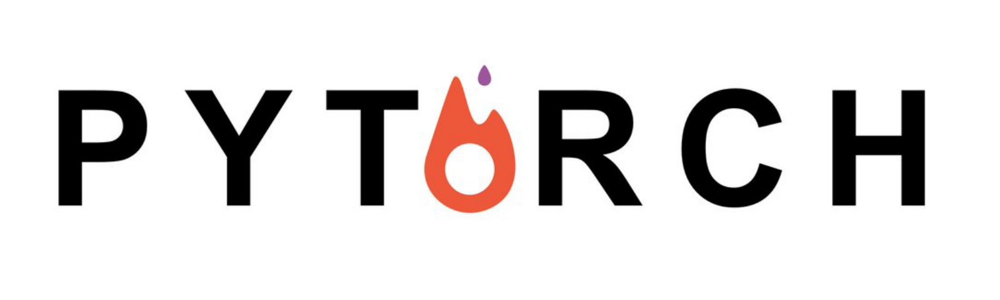

# PyTorch Computer Vision Cookbook

This repo contains my notes following the book [PyTorch Computer Vision Cookbook](https://g.co/kgs/zGXxwA)

## Chapters
* Chapter-1: Getting Started with PyTorch for Deep Learning
* Chapter-2: Binary Image Classification
* Chapter-3: Multi-Class Image Classification
* Chapter-4: Single-Object Detection
* Chapter-5: Multi-Object Detection
* Chapter-6: Single-Object Segmentation
* Chapter-7: Multi-Object Segmentation
* Chapter-8: Neural Style Transfer with PyTorch
* Chapter-9: GANs and Adversarial Examples
* Chapter-10: Video Processing with PyTorch
